# PortfolioBot

A sample bot to help navigate my portfolio webpage.

> **Version**  
> myPortfolio bot is currently in version 1.1  
> - No generic template.  
> - Restricted to navigate information regarding Jorge' portfolio.  

> **Prerequisites**  
> The minimum prerequisites to run this bot are:  
> - The latest update of Visual Studio 2015. You can download the community version [here](http://www.visualstudio.com) for free.  
> - The Bot Framework Emulator. To install the Bot Framework Emulator, download it from [here](https://emulator.botframework.com/). Please refer to [this documentation article](https://github.com/microsoft/botframework-emulator/wiki/Getting-Started) to know more about the Bot Framework Emulator. 

### Introduction
PortfolioBot helps the user navigate the information contained in the portfolio webpage for the user Jorge Fernandez at the address 'https://www.jorgecfernandez.com/'.
PortfolioBot presents a more intuitive, simpler, and clearer UI than other current chat bots. 

* The user always know what is available to him (every error links to instructions). 
* Instructions present a small list with the most important options and a navigation map.
* Bot options are as limited as possible to avoid 'tiring' the user with unnnecessary dialog.
* Bot menus have same UI design to help user recognize them during navigation.
* Bot responses cut to the point.
* The result is a brief, entertaining, and instructive experience for the user.

The current version supports the following features

| PortfolioBot Navigation Map |
|-------------------------------|
|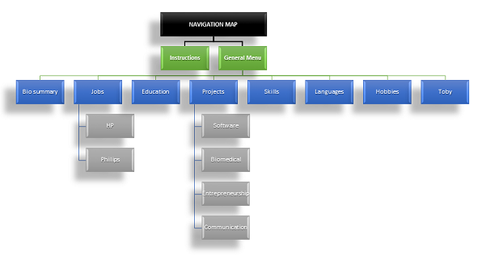|

### Code Highlights

#### Instructions
| PortfolioBot Instructions |
|-------------------------------|
|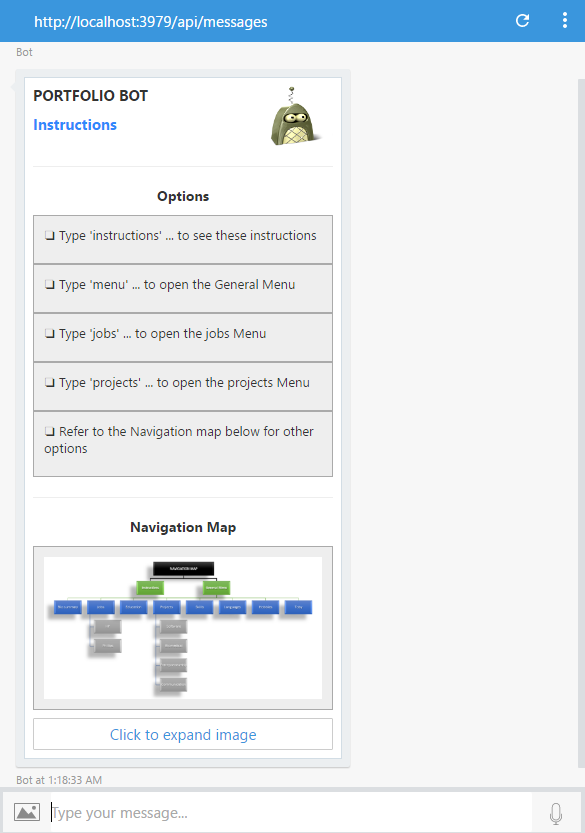|

#### Menus

| General | Projects | Jobs |
|----------|-------|----------|
|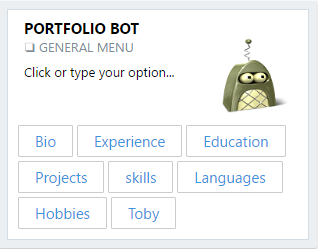|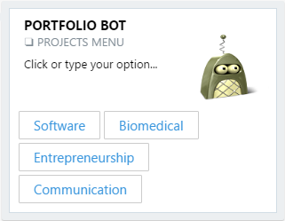|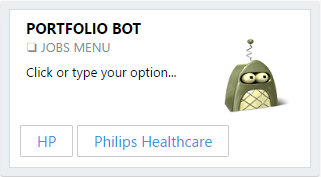|

#### AdaptiveCards

| Education | HP | Philips Healthcare |
|----------|-------|----------|
|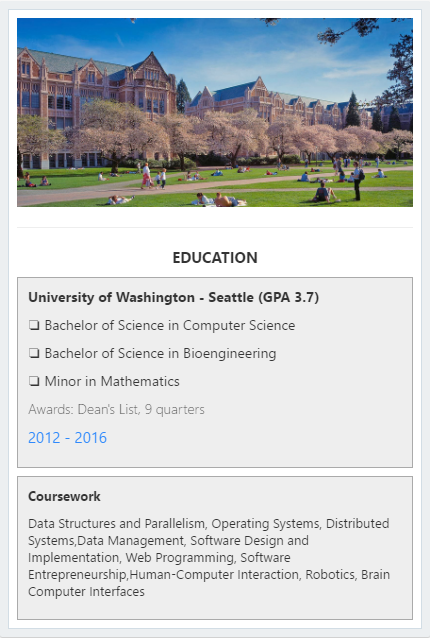|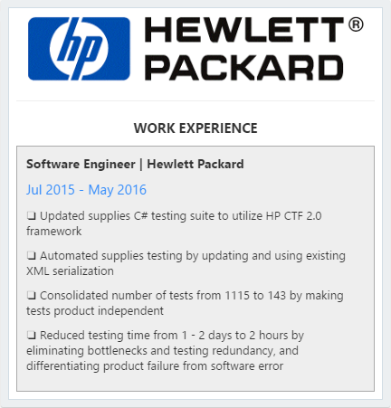||

| Bio | Toby | Skills |Hobbies | Languages |
|----------|-------|----------|-------|----------|
|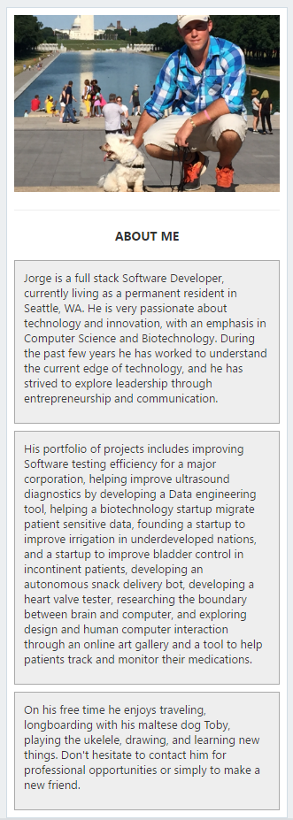|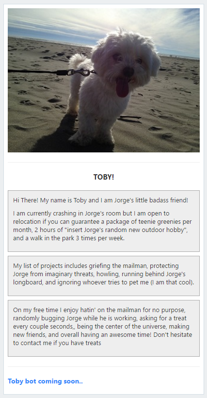|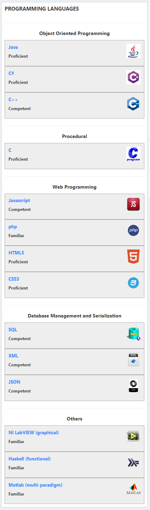|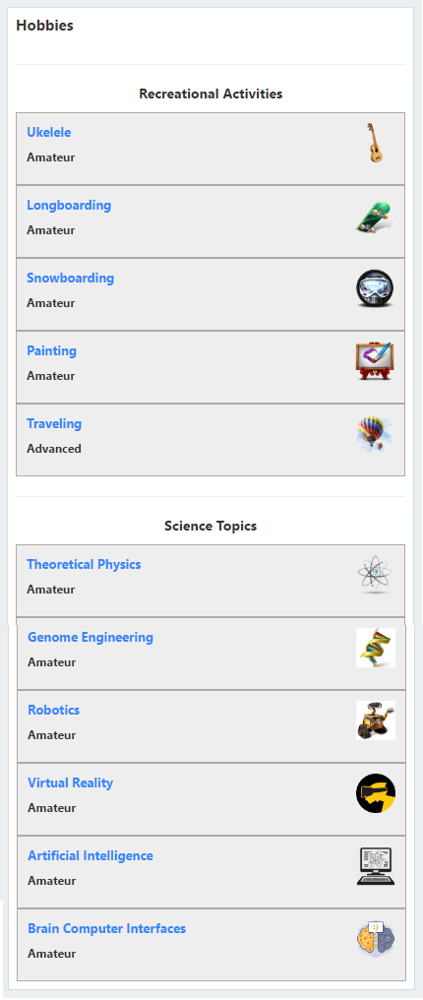|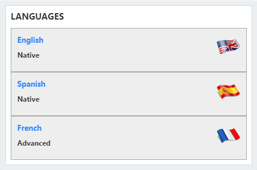|

#### CarrouselCards
| Software Projects |
|----------|
|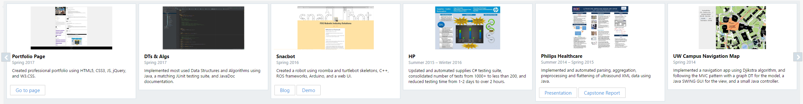|

| Biomedical Projects |
|----------|
|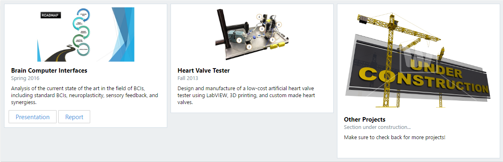|

| Entrepreneurship Projects |
|----------|
|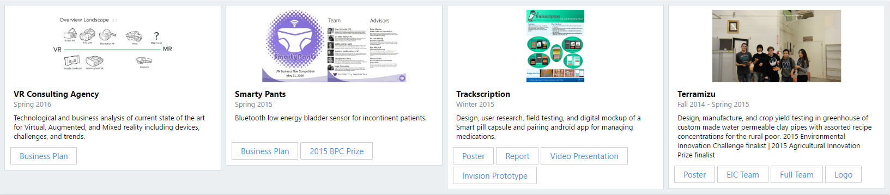|

| Communication Projects |
|----------|
|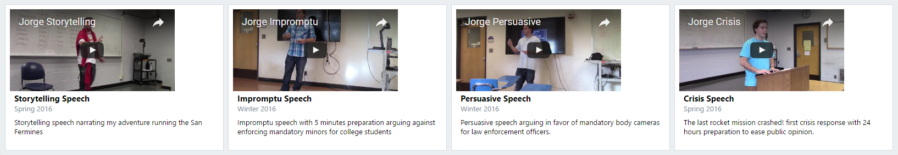|

### Build  
> **Run it locally using Visual Studio**  
> - Fork and Clone this project to your local machine.  
> - In Visual Studio, update all extensions to their latest versions.  
> - Next, open Visual Studio and create a new C# project. Choose the Bot Application template for your new project.
> - Verify that your project references the latest version of the SDK  
>   - Right-click on the project and select Manage NuGet Packages.  
>   - In the Browse tab, type "Microsoft.Bot.Builder".  
>   - Locate the Microsoft.Bot.Builder package in the list of search results, and click the Update button for that package.  
>   - Follow the prompts to accept the changes and update the package.  

> **Test it locally using the Bot Framework Emulator...**  
> - Start the emulator and connect your bot to the emulator by using ``http://localhost:port-number/api/messages``
  usually ``http://localhost:3979/api/messages``  
> - Ignore Microsoft App ID and Microsoft App Password when testing locally.    

> **Build it using continuous integration**
> - Follow the "Run it locally using Visual Studio" instructions above.
> - Create the following services using your Azure Portal account: a **LUIS Cognitive Service**, and a **Web App service**. These 2 services will host our LUIS and Bot Apps.
> - Create a **LUIS app** at [LUIS](https://www.luis.ai/)
> - Create a **bot app** at [Bot Framework](https://dev.botframework.com/)
> - Add your **LUIS Cognitive Service** *key* to your **LUIS apps Azure account** and add it to your **LUIS app** *endpoint key*. This connect your LUIS app to your **LUIS Cognitive Service** subscription. 
> - Add your **Web app service** *url* to your **bot app**, and add your **bot app** *Microsoft app Id* and *password* to your **Web App Service** *App settings*. This will connect your **bot app** to your **Web App service**.  
> - Add your **LUIS app** *Id* to your bot by referencing it from your **bot App** "settings". This will connect your **LUIS app** to your **bot app**.  
> - Add your **bot app** *Microsoft app Id* and *password* to your Web.config local file in your cloned repo and push the change to your forked git repository. 
> - Add your **LUIS app** *Microsoft app Id* and *password* to your RootDialog.cs local file in your cloned repo and push the change to your forked git repository. 
> - Add continuous integration from git to *deployment options* in your **Web App service** and choose your forked repo to sync it.  

> **Test it remotely using the Bot Framework Emulator...** 
> - Test it on your emulator by connecting it to ``https://bot-url.net/api/messages``
> - Start the emulator and connect your bot to the emulator by using ``https://myBotName.azurewebsites.net/api/messages`` where 'bot-url' is the url for your 'LUIS Cognitive Service' app. eg. ``https://myBotName.azurewebsites.net/api/messages``.
> - Add your Bot Framework Microsoft App Id and Password to the emulator

### Incoming Features
 - **Generic template**
    - Abstract and isolate the content for this bot to create a generic reusable template.
 - **Interview mode**
    - Engage into a QnA session with your potential candidate by asking the most frequent questions. Implemented using **new order dialog**, possibly **Azure QnA maker**. 
 - **Contact portfolio user**
    - Connect with the candidate!
 - **Submit Feedback**
    - Submit a feedback suggestion to the candidate using this option
 - **Toby Bot (CYOA mode)**
    - Live an exciting adventure with Jorge's awesome dog! (only in non generic template version). Implemented using a **new order dialog**, new template using adaptive cards...
